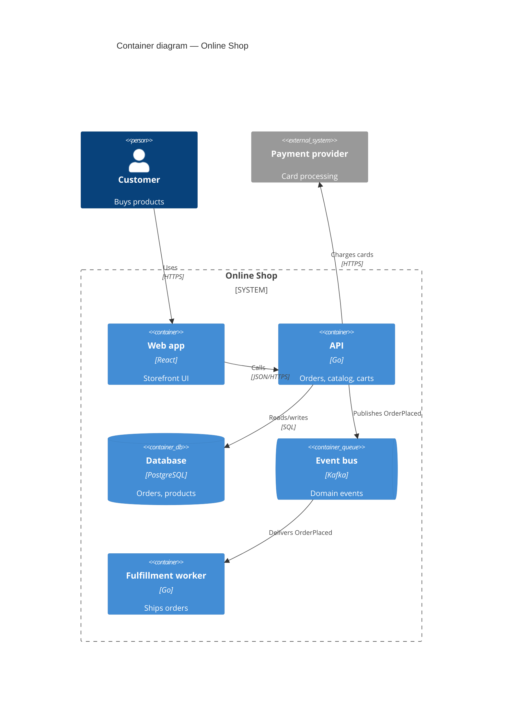

# Modeling C4 architecture

The C4 model describes software at four zoom levels. Most teams need only the first two.

| Level | Shows | Audience | Required? |
|-------|-------|----------|-----------|
| 1. System context | Your system as one box, its users and external systems | Everyone | Yes |
| 2. Container | Deployable/runnable units (apps, services, DBs, queues) and how they talk | Developers, ops | Yes |
| 3. Component | Major building blocks inside one container | Developers of that container | Only if it helps |
| 4. Code | Classes/functions | — | Generate from IDE; do not hand-draw |
| Deployment | Containers mapped to infrastructure (regions, clusters, nodes) | Ops, SRE | For production systems |

## Workflow

1. **Discover from source, not memory.** Read: service directories, `docker-compose*.yml`, Kubernetes/Helm manifests, Terraform/IaC, API clients, message topics, environment variables naming external hosts. List every container and external dependency you find, with the file that proves it.
2. **Draw Level 1**, then **Level 2**. Add Level 3 only for a container that is complex enough to need it.
3. **Label every element**: name, `[technology]`, one-line responsibility.
4. **Label every relationship** with intent and protocol: "Reads/writes orders [SQL/TLS]", "Publishes OrderPlaced [Kafka]". Arrows point in the direction of the dependency/initiation.
5. **Add a title and a legend**; one diagram per level per scope.
6. **Store as code** in `docs/architecture/` next to the ADRs, so diagrams are reviewed and versioned.

## Mermaid example (renders natively on GitHub)

Use `C4Context`, `C4Container`, `C4Component`, or `C4Deployment` as the diagram type. For large models with many views, prefer Structurizr DSL (one model, many generated views).

## Quality checklist

- [ ] Every box has name, technology, and responsibility
- [ ] Every arrow has a verb phrase and protocol
- [ ] No unlabeled acronyms; legend present
- [ ] Diagram matches the code/IaC (cite sources when presenting it)
- [ ] ≤ ~15 elements per diagram; split if larger
