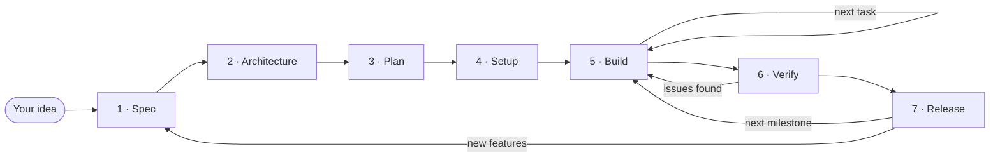
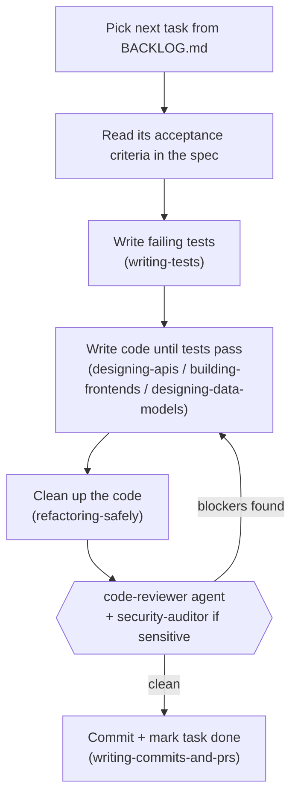

# project-template

A ready-to-use starting point for building new software with Claude Code.
Clone it, open it in Claude Code, describe your idea, and follow the cycle:
**idea → spec → architecture → plan → setup → build → verify → release**.

Every phase is a single command. The skills (how a senior developer and architect work) and the
agents (independent reviewers and testers) are already included and wired into each phase.

**Contents**
1. [Start a new project](#1-start-a-new-project)
2. [The development cycle](#2-the-development-cycle)
3. [How skills and agents work together](#3-how-skills-and-agents-work-together)
4. [Phase by phase](#4-phase-by-phase)
5. [Everyday situations (outside the cycle)](#5-everyday-situations-outside-the-cycle)
6. [Reference: all commands, skills, and agents](#6-reference-all-commands-skills-and-agents)
7. [Project folders](#7-project-folders)
8. [Tips for working with AI](#8-tips-for-working-with-ai)

A full worked example, from idea to release, is in **[docs/PLAYBOOK.md](docs/PLAYBOOK.md)**.

---

## 1. Start a new project

**Requirements:** [Claude Code](https://code.claude.com/docs/en/overview) (terminal, VS Code / JetBrains extension, or the Claude desktop app) and Git.

1. **Create your repo from this template.** On GitHub, click **Use this template → Create a new repository**, then clone it:
   ```bash
   git clone https://github.com/<you>/<your-new-project>.git
   ```
2. **Open it in Claude Code.** Run `claude` inside the folder, or open the folder in the desktop app.
3. **Describe your idea:**
   ```text
   /phase-1-spec A booking app where pet owners book vet appointments online
   ```
4. **Follow the cycle.** Each phase ends by telling you the next command. Lost? Type `/next-step`.

That's it. You don't need to configure anything first; `/phase-4-setup` fills in `CLAUDE.md` for you.

---

## 2. The development cycle



| # | Command | You give | Claude produces | ✋ Your checkpoint |
|---|---------|----------|-----------------|-------------------|
| 1 | `/phase-1-spec <idea>` | The idea; answers to its questions | `docs/spec/PRODUCT_SPEC.md`: users, user stories, acceptance criteria, quality requirements | Approve the spec |
| 2 | `/phase-2-architecture` | Your choice between the stack options | `docs/architecture/`, decision records in `docs/adr/`, the API contract in `docs/api/`, the threat model in `docs/security/` | Approve the architecture |
| 3 | `/phase-3-plan` | Feedback on priorities | `docs/plan/BACKLOG.md`: milestones and small numbered tasks (T-001, T-002, …) | Approve the plan |
| 4 | `/phase-4-setup` | Nothing (answers questions if needed) | A working codebase, linting, tests, CI, and a completed `CLAUDE.md` | See the first test pass |
| 5 | `/phase-5-build` | Optionally a task id | **One task per run:** tests → code → review → commit | Read the summary; repeat for the next task |
| 6 | `/phase-6-verify` | The milestone (e.g. `M2`) | A verification report with a GO or NO-GO decision | Accept the report |
| 7 | `/phase-7-release` | Approval to deploy | Changelog, version tag, deployment, runbook | Approve the deploy |

**Phases 1–3 produce documents only, no code.** This is deliberate: changing a document is cheap,
while changing code built on a wrong idea is expensive.
**Phase 5 is where most of the time goes.** You run it again and again, one task at a time.

---

## 3. How skills and agents work together

There are three kinds of building blocks:

| Block | What it is | How it's used | Examples |
|-------|-----------|---------------|----------|
| **Phase commands** | The cycle itself. Each one is a step-by-step plan for one phase. | **You** type them | `/phase-1-spec`, `/phase-5-build` |
| **Expert skills** | How a senior developer or architect does one specific job: testing, API design, ADRs, and so on. | **Claude** uses them automatically inside the phases, or when your request matches. You can also type them. | `writing-tests`, `designing-apis` |
| **Agents** | Separate Claude instances that check work independently. They start with a fresh view and haven't seen how the work was done. | The phase commands call them, or you ask for them by name | `code-reviewer`, `qa-tester` |

**Why agents?** Someone who built a thing tends to miss its flaws. Each agent runs in its own
separate session. It sees only the result, not the reasoning behind it, so its review is unbiased.
Its long investigation also doesn't fill up your main conversation; you get back just the report.

### What each phase combines

| Phase | Expert skills used | Agents called |
|-------|--------------------|---------------|
| 1 · Spec | — | `spec-reviewer` |
| 2 · Architecture | `designing-systems`, `writing-adrs`, `modeling-c4-architecture`, `designing-data-models`, `designing-apis`, `threat-modeling` | `architecture-reviewer` |
| 3 · Plan | — | — |
| 4 · Setup | `setting-up-ci-cd`, `designing-data-models`, `writing-commits-and-prs` | — |
| 5 · Build | `writing-tests`, `designing-apis`, `designing-data-models`, `building-frontends`, `debugging-systematically`, `refactoring-safely`, `writing-commits-and-prs` | `code-reviewer`, `security-auditor` (for sensitive changes) |
| 6 · Verify | `optimizing-performance` | `qa-tester`, `security-auditor`, `architecture-reviewer` |
| 7 · Release | `planning-observability`, `setting-up-ci-cd`, `debugging-systematically` | — |

### Example: what happens inside one `/phase-5-build`



---

## 4. Phase by phase

### Phase 1 — Spec (`/phase-1-spec <idea>`)
- **Purpose:** agree on *what* to build before anyone decides *how*.
- **What happens:** Claude interviews you in up to three short rounds about the problem, the users,
  the goals, the scope, the constraints, and quality needs like speed, security, and accessibility.
  It then writes the spec. Every user story gets acceptance criteria in the form
  *Given / When / Then*, which later become the tests.
- **Agent:** `spec-reviewer` looks for gaps, vague wording, and missing edge cases.
- **Your job:** answer the questions, then read and approve the spec.

### Phase 2 — Architecture (`/phase-2-architecture`)
- **Purpose:** decide *how* to build it, and write down why.
- **What happens:**
  - Claude proposes 2–3 options and recommends the simplest one that meets the spec. **You pick the stack.**
  - Each key decision (language, database, hosting, login method) becomes an Architecture Decision Record (ADR) in `docs/adr/`.
  - Claude draws architecture diagrams, designs the data model and the API contract, and lists the security threats and their fixes.
- **Agent:** `architecture-reviewer` checks for risks such as single points of failure, security
  gaps, and cost problems.
- **Your job:** choose the stack and approve the architecture.

### Phase 3 — Plan (`/phase-3-plan`)
- **Purpose:** turn the design into small, ordered pieces of work.
- **What happens:** Claude creates milestones and tasks of about a day each (T-001, T-002, …).
  - The first milestone is a **walking skeleton**: the thinnest version of the app that works end to end.
    It proves the architecture before features are piled on.
  - Every task names the acceptance criteria it delivers.
- **Your job:** check that the order and priorities match your goals.

### Phase 4 — Setup (`/phase-4-setup`)
- **Purpose:** a codebase where everything works from day one.
- **What happens:**
  - Claude generates the project with the framework's official tool.
  - It adds a formatter, linter, type checker, test runner, a `.env.example`, Docker Compose for the database, and a CI pipeline.
  - It fills in `CLAUDE.md` with the real commands.
  - It runs a first test to prove everything works.
- **Your job:** look at the output. Claude asks before pushing or creating anything online.

### Phase 5 — Build (`/phase-5-build` or `/phase-5-build T-007`)
- **Purpose:** deliver one task, fully done.
- **What happens:** tests first, then the code, then cleanup, then an independent review by the
  `code-reviewer` agent (plus `security-auditor` for logins, payments, uploads, or personal data).
  Claude fixes the blocking findings, commits, and marks the task done.
- **Your job:** read the summary, and answer questions about product behavior. Then run it again for the next task.

### Phase 6 — Verify (`/phase-6-verify M2`)
- **Purpose:** proof that the milestone works, is secure, and is fast enough, before it reaches users.
- **What happens:**
  - The full test suite runs.
  - `qa-tester` checks every acceptance criterion and probes edge cases.
  - `security-auditor` audits the code and dependencies.
  - Performance is measured against the spec's targets.
  - `architecture-reviewer` checks that the code still matches the design.
- **Output:** `docs/release/VERIFY-M2.md` with a **GO / NO-GO** decision. Any problems become new tasks for Phase 5.

### Phase 7 — Release (`/phase-7-release 1.0.0`)
- **Purpose:** ship safely, with a way back.
- **What happens:**
  - Claude checks production readiness: health checks, logs, alerts, and a runbook with rollback steps.
  - It writes the changelog from the commits.
  - It asks for your approval, then tags the release and deploys through the pipeline.
  - After the release, it watches the error rate and response times.
- **Your job:** approve the deploy.

---

## 5. Everyday situations (outside the cycle)

You don't need a phase command for everything. Just describe the situation and Claude picks the
matching skill automatically, or type the skill name yourself:

| Situation | Just say… | Uses |
|-----------|-----------|------|
| Something is broken | "Users get a 500 error when booking on Sundays" | `debugging-systematically` |
| A test fails randomly | "test_booking_overlap fails 1 in 10 runs" | `writing-tests` |
| Code is getting messy | "Clean up the booking service, it's too long" | `refactoring-safely` |
| It's slow | "The calendar page takes 5 seconds to load" | `optimizing-performance` |
| Review a pull request | "Use the code-reviewer agent on PR branch feat/T-012" | `code-reviewer` agent |
| Security worry | "Use the security-auditor agent on the payment code" | `security-auditor` agent |
| A new technical decision | "Record that we're switching from REST to WebSockets for live updates" | `writing-adrs` |
| Updated diagram | "Update the architecture diagram" | `modeling-c4-architecture` |
| A big new feature after launch | "Write a design doc for adding video consultations" | `writing-design-docs`, then add tasks and use `/phase-5-build` |
| Replace an old part | "Plan moving from SQLite to PostgreSQL" | `planning-migrations` |
| Add monitoring | "Set up alerts for the booking API" | `planning-observability` |
| Health check of the whole system | "Use the architecture-reviewer agent on the whole project" | `architecture-reviewer` agent |
| Lost track | `/next-step` | `next-step` |

**Changing requirements:** edit the spec first (or ask Claude to update it). Then add or adjust tasks
in the backlog and continue with `/phase-5-build`. The docs stay the source of truth.

---

## 6. Reference: all commands, skills, and agents

### Phase commands (you run these)

| Command | Does |
|---------|------|
| `/phase-1-spec <idea>` | Idea → approved product spec |
| `/phase-2-architecture` | Spec → architecture, ADRs, data model, API, threat model |
| `/phase-3-plan` | Architecture → backlog of milestones and tasks |
| `/phase-4-setup` | Backlog → working codebase with tooling and CI |
| `/phase-5-build [T-xxx]` | Builds one task: tests, code, review, commit |
| `/phase-6-verify [M-x]` | Verifies a milestone → GO / NO-GO report |
| `/phase-7-release [version]` | Changelog, tag, deploy, post-release check |
| `/next-step` | Tells you where you are and what to run next |

### Expert skills (used automatically; you can also type `/<name>`)

**Developer**

| Skill | What it's for | Example request |
|-------|---------------|-----------------|
| `writing-tests` | Test-first development, good test coverage, fixing flaky tests | "Add tests for the pricing module" |
| `debugging-systematically` | Finding the real cause of a bug and proving the fix | "Why does checkout crash for guests?" |
| `refactoring-safely` | Cleaning up code without changing what it does | "Split this 400-line file" |
| `reviewing-code` | Review ranked by severity, with file:line and suggested fixes | "Review my changes" |
| `designing-apis` | REST/gRPC/GraphQL/event contracts, errors, pagination, versioning | "Design the bookings API" |
| `building-frontends` | UI structure, state, forms, accessibility, page speed, UI tests | "Build the booking form" |
| `securing-code` | Security review based on OWASP, the standard checklist of common web vulnerabilities | "Is the login secure?" |
| `optimizing-performance` | Measure → find the bottleneck → fix → measure again | "Make the search faster" |
| `writing-commits-and-prs` | Clean commit messages and PR descriptions | "Commit this" |
| `setting-up-ci-cd` | Pipelines, environments, deployment strategies, rollback | "Add a staging deployment" |

**Architect**

| Skill | What it's for | Example request |
|-------|---------------|-----------------|
| `designing-systems` | Requirements → options → trade-offs → design | "How should we build real-time chat?" |
| `writing-adrs` | Recording *why* a technical decision was made | "Record why we chose PostgreSQL" |
| `modeling-c4-architecture` | Architecture diagrams drawn from the real code | "Draw the architecture" |
| `designing-data-models` | Database choice, schema, indexes, safe migrations | "Add a required column to a big table" |
| `threat-modeling` | Finding what an attacker could do, before building | "Threat model the payment flow" |
| `reviewing-architecture` | Risk review across reliability, security, cost, and more | "Is this ready for production?" |
| `planning-observability` | Uptime targets, logs, metrics, traces, useful alerts | "Set up monitoring" |
| `writing-design-docs` | A design doc for a large feature added after launch | "Design doc for video calls" |
| `planning-migrations` | Replacing systems step by step, with rollback | "Move us to PostgreSQL" |

### Agents

Ask for them by name, for example *"Use the qa-tester agent on milestone M2"*.
Type `/agents` in Claude Code to see them.

| Agent | What it serves | Can it edit files? | Used in |
|-------|----------------|--------------------|---------|
| `spec-reviewer` | Finds gaps, vague wording, and untestable criteria in the spec | No | Phase 1 |
| `architecture-reviewer` | Independent architecture risk review | No | Phases 2, 6 |
| `code-reviewer` | Independent review of a change: bugs, security, tests | No | Phase 5 |
| `security-auditor` | Security audit of code and dependencies; checks the threat model is implemented | No | Phases 5, 6 |
| `qa-tester` | Checks each acceptance criterion has a passing test; writes missing tests | Test files only | Phase 6 |

---

## 7. Project folders

The template starts with an empty `docs/` structure. The phases fill it in:

```
CLAUDE.md                   project memory, read by Claude every session (filled by phase 4)
docs/
  spec/PRODUCT_SPEC.md      phase 1 — what we build and how we know it works
  architecture/             phase 2 — ARCHITECTURE.md (with diagrams), DATA_MODEL.md
  adr/                      phase 2+ — one file per technical decision (0001-..., 0002-...)
  api/                      phase 2 — API contract (e.g. openapi.yaml)
  security/                 phase 2 — THREAT_MODEL.md
  plan/BACKLOG.md           phase 3 — milestones and tasks, with status
  release/                  phases 6–7 — verification reports, RUNBOOK.md
.claude/
  skills/                   the phase commands and the expert skills
  agents/                   the reviewer and tester agents
src/, tests/, ...           created in phase 4 for your chosen stack
```

---

## 8. Tips for working with AI

- **You are the decision-maker.** Claude proposes and explains the trade-offs; you choose. The
  phases stop at checkpoints and wait for you on purpose.
- **Don't skip the spec.** Most bad results from AI come from unclear requirements, not bad code.
- **One task at a time.** Small changes are easy to review and easy to undo.
- **Trust tests, not "looks right."** A task is done when its acceptance tests pass.
- **Read the summaries and skim the diffs.** Claude is fast but can be wrong.
- **Keep the docs current.** If reality changes, update the spec or add an ADR. Claude reads
  these files to understand your project, so outdated docs lead to wrong code.
- **Start fresh sessions often.** Each phase and task can start a new conversation. The docs and the
  backlog carry the context, and `/next-step` picks up where you left off.

---

License: [MIT](LICENSE)
